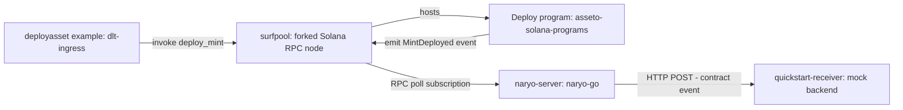

# End-to-End Setup: Programs + Gateway + Listener

This tutorial exercises the three grant deliverables together, in a single local run:

1. [`dlt-ingress`](dlt-ingress/) (ML2) builds, signs, and sends real Solana transactions, exercising both the **Factory** and **Deploy** programs in [`asseto-solana-programs`](asseto-solana-programs/) (ML1).
2. The **`deploy_mint`** instruction of the **Deploy** program emits a `MintDeployed` Anchor event on-chain.
3. [`naryo-go`](naryo-go/) (ML3) detects that event and broadcasts it to a downstream consumer.

It combines naryo-go's own [Solana quickstart](naryo-go/docs/tutorials/naryo_quickstart.md) with dlt-ingress's own ["Running the examples"](dlt-ingress/README.md#running-the-examples) section, adapted so everything runs from this repo's local checkouts instead of separate private-repo clones.



## Prerequisites

- Docker & Docker Compose
- Go
- [Anchor CLI](https://www.anchor-lang.com/docs/installation) and the Solana CLI

## Step 1: Start naryo-go's quickstart stack

From [`naryo-go/`](naryo-go/):

```bash
make example-quickstart
```

This brings up Postgres, a [surfpool](https://github.com/solana-foundation/surfpool) local Solana RPC node, `naryo-server` (configured by [`examples/quickstart/application.yaml`](naryo-go/examples/quickstart/application.yaml) to watch program `HCe5Um7ThFBzDSyn256EPQvyr6jy6E66ydzZ5hMta3Tq` for a `MintDeployed` event), and `quickstart-receiver`, a mock HTTP backend that will receive the event.

Confirm everything is up:

```bash
docker compose ps
```

`postgres` and `surfpool` should show `healthy`; `naryo-server` and `quickstart-receiver` should be `running`.

## Step 2: Build and deploy the programs

`Anchor.toml` points the local wallet at `./test-wallet.json`, which isn't checked into this repo (it would be a private key). From [`asseto-solana-programs/`](asseto-solana-programs/), create one and fund it against the surfpool instance already running from Step 1:

```bash
solana-keygen new --outfile test-wallet.json
solana airdrop 1000
```

Then build and deploy:

```bash
anchor build
anchor program deploy
```

If the deployed program address doesn't match `HCe5Um7ThFBzDSyn256EPQvyr6jy6E66ydzZ5hMta3Tq` (e.g. because a fresh program keypair was used instead of the checked-in one), update `contractAddress` in `naryo-go/examples/quickstart/application.yaml` to match and run `docker compose restart naryo-server` (from `naryo-go/`).

## Step 3: Start dlt-ingress's local infrastructure

From [`dlt-ingress/`](dlt-ingress/):

```bash
docker-compose up -d
```

This starts dlt-ingress's own Postgres instance and a [ministack](https://hub.docker.com/r/ministackorg/ministack) instance (emulating AWS, including KMS) on `localhost:4566`, matching the defaults in `src/main/config/application.yml`. dlt-ingress's default `ASSETO_DEFAULT_NETWORK_URL` is `http://127.0.0.1:8899` — the same surfpool instance already running from Step 1, so no separate validator is needed.

> If `go mod` needs to fetch ioBuilders-private Go modules here, see dlt-ingress's own `.netrc` / `GOPRIVATE` setup note in [`dlt-ingress/README.md`](dlt-ingress/README.md).

## Step 4: Run dlt-ingress's examples

`dlt-ingress/src/examples/` contains three standalone, runnable programs that drive dlt-ingress through its command buses to exercise the **Factory** and **Deploy** programs end to end. Run them from `dlt-ingress/`, in this order:

### 4.1 Initialize the Factory

```bash
go run ./src/examples/factoryinitialize
```

Initializes the Factory program's singleton Factory account: creates a payer and a manager account and appoints the manager. On success it logs the manager's account id — copy it for the next step.

### 4.2 Onboard an asset class

Paste the manager account id logged above into the `managerDltAccountId` constant near the top of `src/examples/factorysetupassetclass/main.go`, then:

```bash
go run ./src/examples/factorysetupassetclass
```

Runs the full asset class onboarding flow against the Factory program: `create_asset_class`, `init_asset_class_version`, `enable_asset_class_version_functionalities` (every functionality enabled), and `finalize_asset_class_version`, as four separate transactions. On success it logs the asset class owner's account id.

### 4.3 Deploy an asset

```bash
go run ./src/examples/deployasset
```

Independent of the two examples above. Creates a sender and a mint account, airdrops SOL to the sender on the local Solana network, and signs and sends a transaction calling the **`deploy_mint`** instruction of the **Deploy** program — logging the resulting mint account id on success. This is the call that emits the `MintDeployed` event naryo-go is watching for.

Each run loads dlt-ingress's configuration, starts the application, and logs progress and the resulting account ids on success.

## Step 5: Observe naryo-go detect and broadcast the event

In a separate terminal, from `naryo-go/`:

```bash
docker compose logs -f quickstart-receiver
```

Within a second or two, the receiver's logs show the `MintDeployed` event that naryo-go captured from the chain and broadcast, including the decoded instruction parameters (mint, decimals, name, symbol, etc.) and the transaction signature that carried it.

## Step 6: Trigger and observe a failed transaction

`factory`'s `initialize` instruction creates the singleton Factory PDA with Anchor's `init` constraint, which can only succeed once. Re-run 4.1 from `dlt-ingress/`:

```bash
go run ./src/examples/factoryinitialize
```

This second call fails on-chain: the Factory PDA already exists, so the `init` constraint's account-creation CPI is rejected by the System Program. naryo-go's quickstart config carries a `TRANSACTION` filter for `FAILED` status scoped to the Factory program address (`FEY9E77nH7R1gLGNxkhYKchJpB6MgpMrWMhkNXrNhzR5`), alongside the one already covering the Deploy program — so this failure is captured too.

Watch `quickstart-receiver`'s logs (same as Step 5). Within a second or two it shows the failed transaction on `/transactions`, with `hasError: true`. Unlike the Deploy program, `application.yaml`'s `programErrors` table has no entry mapping this program's `Custom(0)` to a friendly name, so `reason` falls back to the generic `"custom program error: 0"` instead of a decoded name like `AccountAlreadyInUse` — a useful contrast with the Deploy program's own duplicate-call case, which naryo-go's own [quickstart tutorial](naryo-go/docs/tutorials/naryo_quickstart.md#trigger-a-failed-transaction-and-observe-revert-reason-decoding) demonstrates does have a mapped name.

## Step 7: Tear down

```bash
# from naryo-go/
make compose-down

# from dlt-ingress/
docker-compose down
```

## What this demonstrates

- **ML2** — dlt-ingress builds, signs, and sends real SVM transactions against the ML1 programs (Factory onboarding plus a Deploy call), through the same command path it uses for EVM.
- **ML1** — the Factory program processes the asset-class onboarding flow, and the Deploy program processes `deploy_mint` and emits a `MintDeployed` Anchor event.
- **ML3** — naryo-go detects that event through its event filter, decodes it, and broadcasts it to a downstream consumer; it also captures failed transactions against both the Factory and Deploy programs.

naryo-go's own quickstart covers a second failed-transaction variant — a duplicate `deploy_mint` call, whose error *is* mapped in `programErrors` and so decodes to a friendly name — see its ["Trigger a failed transaction"](naryo-go/docs/tutorials/naryo_quickstart.md#trigger-a-failed-transaction-and-observe-revert-reason-decoding) section.
