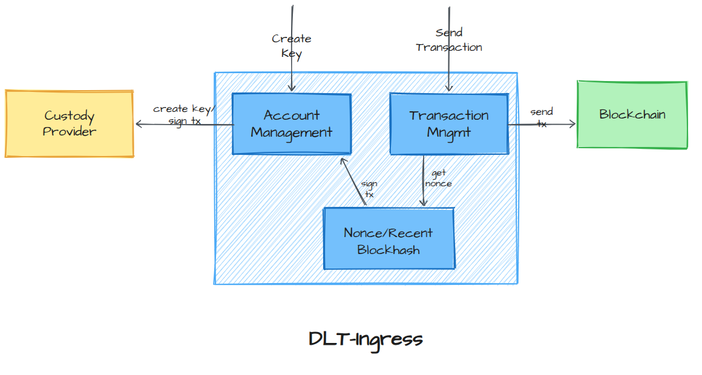

# dlt-ingress

dlt-ingress is a Go service that builds, signs, and submits transactions to blockchains and other DLTs, without ever exposing the private keys used to sign them. It delegates signing to external custody providers (AWS KMS, Dfns), transparently manages EVM nonces and Solana recent blockhashes, and can operate several networks of different DLT technologies concurrently. Internally it follows a hexagonal, event-driven architecture with command/query separation (CQS).

## Getting Started

### **Prerequisites**

- Install [Go](https://go.dev/dl/)
- (Optional) Docker for database services

No private repository access is required to build or test this module: it only depends on public Go modules, plus `internal/vendor/iob-go-core`, a vendored copy of ioBuilders' internal application framework kept in-tree so `go build`/`go test` work without ioBuilders' GitLab.

## Overview

dlt-ingress is the transaction-submission layer. Other bounded contexts (or external callers) ask it to create blockchain accounts/keys and to build, sign, and send transactions against smart contracts on any configured network, and dlt-ingress takes care of everything that is specific to interacting with a DLT:

- **Key custody**: accounts are created and transactions are signed through a pluggable **custody provider** (AWS KMS or Dfns). The private key material never leaves the custodian — dlt-ingress only ever requests a public key or a signature over a digest/message, it never holds or transmits raw private keys.
- **Nonce management (EVM)**: for account-based, nonce-ordered chains (Ethereum-compatible / EVM networks), dlt-ingress tracks and reserves the next nonce per `(account, network)` pair, reconciling its own record against the chain's pending nonce so transactions are never submitted out of order or reused.
- **Recent blockhash (SVM)**: for Solana-compatible (SVM) networks, dlt-ingress fetches and caches the network's recent blockhash so transactions carry a valid, fresh blockhash without hitting the RPC endpoint on every single transaction.
- **Multi-network, multi-DLT**: any number of networks can be configured simultaneously, each with its own DLT technology (EVM, SVM, …), RPC endpoint, and chain-specific parameters (gas price/limit, priority fee, compute unit price, etc.), and they all operate independently and concurrently.
- **Reliability**: transaction submission per network is serialized through a queue so that concurrent requests never race on the same nonce or blockhash, and failed transactions can be retried explicitly.



## Architecture

dlt-ingress is written in Go and follows a **hexagonal architecture** (ports & adapters), organized around **event-driven** communication and **CQS** (Command/Query Separation), implemented through dedicated command, query, and event buses.

### Layers

The code is split into three layers:

- **`domain/`** — pure business model, free of infrastructure concerns: entities and value objects such as `custodykey`, `nonce`, `queuelock`, `txqueueslot`, and `transaction` (with `evmtransaction`, `svmtransaction`, and `failedtransaction` variants), plus shared enums like the `Dlt` type (`EVM`, `SVM`, …).
- **`app/`** — the application layer, split by CQS responsibility:
  - `app/command` — write-side use cases (`buildtransaction`, `createkey`, `signandsend`, `retrytransaction`, `savefailedtransaction`, `transitfailedtransactiontoretried`), each handler orchestrating the domain and the ports it needs.
  - `app/query` — read-side use cases (`contractread`, `getcustodykey`, `getfailedtransactions`, `gettransaction`).
  - `app/service` — app services services shared across handlers (e.g. the transaction service used to build/sign/send).
- **`port/`** — the boundary of the hexagon: interfaces and adapters connecting the application layer to the outside world — database repositories, custody providers, chain clients, HTTP endpoints, event listeners, and the command/query adapters exposed on the buses.

### Custody providers

The `port/custody` package defines a single `Port` interface (`CreateKey`, `Sign`) with two adapters, selected by configuration:

- **AWS KMS** — creates asymmetric keys in KMS and requests signatures over the transaction digest (ECDSA for EVM, with signature normalization; Ed25519 for SVM).
- **Dfns** — delegates key creation and signing to the Dfns custody API/SDK.

In both cases, dlt-ingress only ever asks the provider for a public key or a signature; the private key is generated and stored by the custodian and is never returned to, or held by, dlt-ingress.

### EVM nonce management

Each `(account, network)` pair has a tracked `Nonce` row. When a transaction is built, dlt-ingress locks that row, compares it against the network's current pending nonce, and reserves the next nonce to use — reconciling local state with chain state so nonces are never reused or skipped, even under concurrent requests for the same account.

### SVM recent blockhash

For Solana-compatible networks, a blockhash provider fetches the network's recent blockhash and caches it per network for a short period, so transactions get a valid blockhash without a network round trip on every submission.

### Concurrency control

Submitting a transaction (building, signing, and sending) is serialized per network through a database-backed bounded blocking queue: a slot is taken before building/signing/sending and released afterwards (or on failure). This prevents a configured number of concurrent requests on the same network from racing, while different networks — regardless of their underlying DLT technology — proceed independently and concurrently.

### Multi-network, multi-DLT configuration

Networks are configured as a list, each entry carrying its own id, RPC URL, DLT technology (`EVM`, `SVM`, …) and technology-specific parameters (chain id, gas price/limit and priority fee for EVM; compute-unit price for SVM). At startup, dlt-ingress builds a client registry per technology and looks up the right client for a given network id at runtime, which is what allows an arbitrary mix of EVM and SVM (and future DLT) networks to run side by side in the same instance. See **src/main/config/application.yml** file for configuration options.

### Failed transactions and retries

If sending a transaction fails, it is recorded. A retry can then be triggered explicitly: dlt-ingress reloads the original transaction, takes a queue slot for that network, rebuilds it with a fresh nonce (and an optionally bumped fee), signs and sends it again, links the new transaction to the original one, and finally transitions the failed-transaction record to "retried".

## Running the examples

`src/examples/` contains standalone, runnable programs that drive a running dlt-ingress application through its cross buses to exercise real smart contract calls end to end (create accounts, airdrop SOL, sign and send a transaction). They're a good way to see the service work against a live local Solana network without writing any test code.

Each `main.go` under `src/examples/<name>/` is its own `package main` and is run individually with `go run ./src/examples/<name>`. They exercise the **Factory** and **Deploy** programs from [asseto-solana-programs](https://github.com/IoBuilders/asseto-solana-programs):

- **`factoryinitialize`** — initializes the Factory program's singleton Factory account, creating a payer and a manager account and appointing the manager who can later nominate asset class managers. On success it logs the manager's account id.
- **`factorysetupassetclass`** — runs the full asset class onboarding flow against the Factory program in one execution: `create_asset_class`, `init_asset_class_version`, `enable_asset_class_version_functionalities` (every functionality enabled), and `finalize_asset_class_version`. Requires the Factory account to already be initialized: run `factoryinitialize` first, then paste the manager account id it logged into the `managerDltAccountId` constant near the top of `factorysetupassetclass/main.go` before running it. On success it logs the asset class owner's account id.

  These four instructions are sent as four separate transactions (with a short sleep between each), not bundled into a single transaction. The `signandsend` cross command currently accepts only one smart contract call per dispatch, and the first instruction is signed by the manager while the other three are signed by the owner, so combining them would first require the `signandsend` port to support multi-instruction transactions.
- **`deployasset`** — creates a sender and a mint account, airdrops SOL to the sender on the local Solana network, and calls the **deploy_mint** instruction of the **Deploy** program to deploy an asset. It's self-contained and doesn't depend on the other examples.

### 1. Start the local infrastructure

The examples target a local Solana validator plus dlt-ingress's own dependencies (Postgres, and an AWS-compatible endpoint for KMS via [ministack](https://hub.docker.com/r/ministackorg/ministack)):

```bash
docker-compose up -d
```

This starts Postgres on `localhost:5434` and a ministack instance (emulating AWS, including KMS) on `localhost:4566` — matching the defaults in `src/main/config/application.yml`. You additionally need a local Solana validator reachable at `http://127.0.0.1:8899`.

### 2. Start local Solana validator and deploy programs 

* Download and install the [asseto-solana-programs](https://github.com/IoBuilders/asseto-solana-programs) anchor project.
* Then, build the programs:
```bash
anchor build
```
* Run a solana local validator
```bash
surfpool start --port 8899 --ws-port 8900 --host 127.0.0.1 --offline --log-level warn --block-production-mode clock --no-deploy
```
* Finally, we deploy the programs
```bash
anchor program deploy
```

### 3. Run the examples

Run each example with `go run ./src/examples/<name>`:

```bash
# Initializes the Factory account
go run ./src/examples/factoryinitialize
```

`factoryinitialize` logs the manager account id it registered. Before continuing, paste that id as the value of the `managerDltAccountId` constant on `src/examples/factorysetupassetclass/main.go:49`, then run it:

```bash
# Creates and finalizes an asset class on the Factory (requires the manager account id set above)
go run ./src/examples/factorysetupassetclass
```

```bash
# Deploys an asset via the Deploy program (independent of the Factory examples)
go run ./src/examples/deployasset
```

Each run loads the configuration, starts the dlt-ingress application, creates the accounts it needs through custody, airdrops SOL where required, and signs and sends the corresponding transaction(s) — logging progress and the resulting account ids on success.
