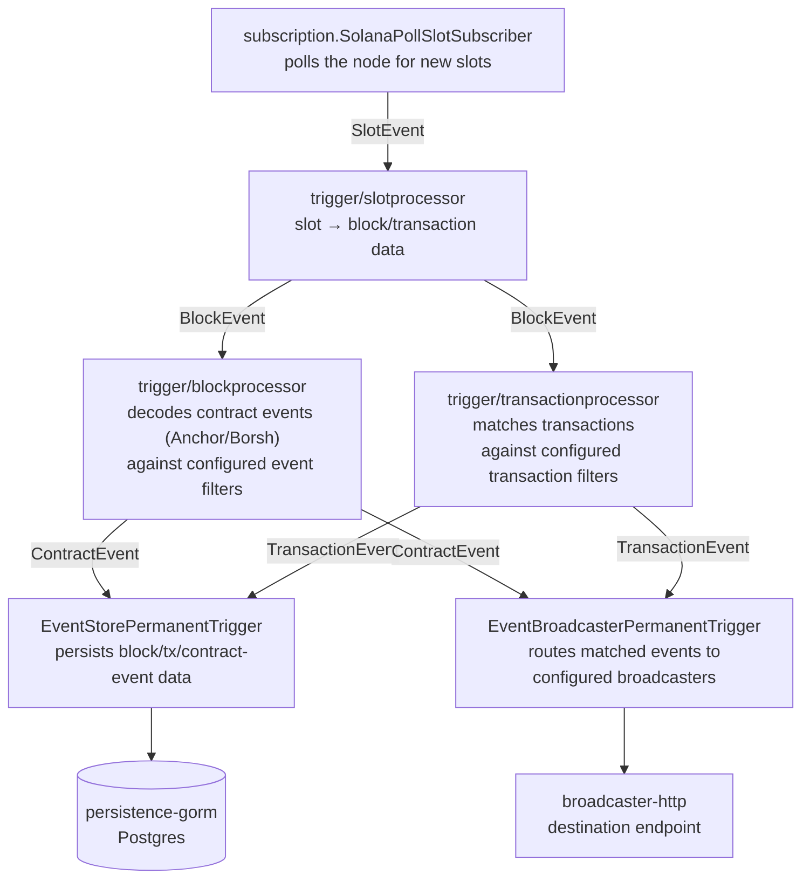

# Architecture

This document provides a high-level overview of naryo-go's architecture and the main runtime
components.

## Layers and modules

naryo-go is a multi-module Go workspace (`go.work`), split into four libraries and one runnable
binary:

| Module | Role |
|---|---|
| `core` | Domain model + application ports. Framework-agnostic: connects to nodes, applies filters, decodes on-chain data, and produces normalized events. |
| `broadcaster-http` | Adapter implementing `core`'s broadcast port over HTTP. |
| `broadcaster-kafka` | Adapter implementing `core`'s broadcast port over Kafka. |
| `persistence-gorm` | Adapter implementing `core`'s store ports over GORM/Postgres, with Atlas-managed migrations. |
| `server` | The microservice binary (`server/cmd/server`). Loads YAML/env configuration and wires `core` + `persistence-gorm` + `broadcaster-http` together. This is the only runnable artifact. |

Inside `core`, the layering is hexagonal-ish:

- `core/domain/<aggregate>`: the domain model (`node`, `filter`, `event`, `broadcaster`, `store`,
  `decoder`, `block`, ...), free of infrastructure concerns.
- `core/app/<port>`: application-layer ports and orchestration (`subscription`, `dispatch`,
  `trigger`, `routing`, `broadcast`, `store`, `configurationmanager`, ...) that the domain is
  driven through.
- `core/infrastructure`: concrete implementations bound to real infrastructure, such as the
  Solana RPC client, the Anchor/Borsh decoder, and YAML/env-driven configuration loading.
- `broadcaster-http`, `broadcaster-kafka`, and `persistence-gorm` implement `core`'s ports
  (`dispatch.Dispatcher` producers, `store.*EventStore`) as adapters. They depend on `core`, never
  the reverse.

This mirrors the Java original's Core / Persistence integrations / Broadcasters split, minus the
pieces that don't apply yet. See [Compared to the Java original](#compared-to-the-java-original).

## Functional data flow

Every stage above is a `trigger.Trigger` registered on the same `dispatch.Dispatcher`
(`core/app/dispatch`): a trigger doesn't call the next one directly, it dispatches the event it
produced, and the dispatcher fans it out to every registered trigger again. This is why a trigger
that needs to dispatch further events lives in its own `core/app/trigger/<name>` subpackage
(`slotprocessor`, `blockprocessor`, `transactionprocessor`) rather than depending on a narrower
interface to avoid an import cycle with `core/app/dispatch`.

1. **Subscription**: `core/app/subscription`'s poll subscriber reads new slots from the Solana
   node and dispatches a `SlotEvent`.
2. **Slot processing**: `core/app/trigger/slotprocessor` turns a slot into its block/transaction
   data and dispatches a `BlockEvent`.
3. **Filtering & decoding**: `core/app/trigger/blockprocessor` decodes contract event payloads
   (via `core/domain/decoder`, implemented in `core/infrastructure/decoder/solana` for
   Anchor/Borsh) against the node's configured event filters (`core/domain/filter`).
   `core/app/trigger/transactionprocessor` matches transactions against transaction filters the
   same way.
4. **Persistence** (optional): the store trigger persists matched block/transaction/contract-event
   data through `core/app/store`'s ports, backed by `persistence-gorm`.
5. **Broadcasting**: the broadcaster trigger routes matched events (via `core/app/routing`, by
   broadcaster target, `CONTRACT_EVENT` or `TRANSACTION`) to every configured `broadcast.Producer`,
   backed by `broadcaster-http`.

Unlike the Java original, there's no separate "Confirmation Management" or "Enrichment & Event
Router" stage yet. See below.

## Deployment models

- **Reference server**: `server` is the reference runnable binary. Build and run it as a Docker
  Compose stack (Postgres + a local Solana RPC node for development).
- **Embedded library**: `core`, `broadcaster-http`, and `persistence-gorm` are ordinary Go
  modules, and nothing about them is tied to `server`. `server/cmd/server/main.go` *is* the
  reference example of embedding: it does its own flag parsing and exposes a `/health` endpoint,
  but the actual wiring is just calling exported constructors (`coresetup.SetupConfigManagers`,
  `persistencegormsetup.Setup`, `broadcasterhttpsetup.Setup`, `coresetup.Setup`,
  `coreModule.Bootstrapper.Start(ctx)`). Any Go program can call the same functions the same way.

Unlike Java's Spring Boot integration (`spring-core`), there's no autoconfiguration/YAML-parsing
layer doing this wiring for you. It's closer to Java's "Core Library (Advanced)" mode, where you
wire the pieces yourself. And unlike Java's published Maven/Gradle artifacts, naryo-go's modules
aren't published anywhere yet: their module paths
(`gitlab.com/iobuilders/projects/eng/naryo-go/...`) point at this private repo, so `go get`ting
them from outside this repo doesn't work today. Embedding is architecturally supported, but
requires this repo to be published (publicly, or via a resolvable module proxy) first.

## Compared to the Java original

naryo-go is a Go port of [Naryo](https://github.com/LF-Decentralized-Trust-labs/Naryo), scoped to
what's been ported so far:

- **Chains**: Solana only. The Java original also supports Ethereum-compatible (EVM) chains and
  Hedera; naryo-go doesn't have those node types, filters, or decoders yet.
- **Broadcasters**: HTTP only. The Kafka and RabbitMQ modules exist but carry configuration
  structure alone — their producers are stubs, so nothing is published to either broker yet.
- **Persistence**: GORM/Postgres only. The Java original also ships a MongoDB integration.
- **Confirmation & invalidation**: not yet implemented. naryo-go's contract events carry a
  Solana commitment-level status (see [Concepts](concepts.md#event)), but naryo-go doesn't count
  block confirmations after the fact or invalidate an already-broadcast event on a reorg the way
  the Java original does.
- **Dynamic configuration API**: not yet implemented. Filters and broadcasters are configured at
  startup (YAML/env) only; the Java original also supports managing them at runtime via a REST API.
- **Embedding**: architecturally supported (see [Deployment models](#deployment-models) above),
  but naryo-go's modules aren't published anywhere yet, so nothing outside this repo can `go get`
  them today.

For configuration details see
[`examples/quickstart/application.yaml`](../examples/quickstart/application.yaml) and
`core/infrastructure/config`; naryo-go doesn't have a dedicated configuration guide yet the way the
Java original does.
