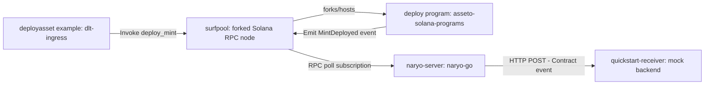

# Naryo-go Quickstart: Solana

This guide will show you how to quickly set up naryo-go to capture an event from a Solana program
and broadcast it to a mock backend. You'll see naryo-go in action in just a few simple steps!

## Requirements

- Docker & Docker Compose
- Git

## Step 1: Deploy Your Local Environment

From a clone of this repository, start the quickstart environment using Docker Compose:

```bash
make example-quickstart
```

This command deploys the following components:

- **Postgres**: naryo-go's event/filter store.
- **[surfpool](https://github.com/solana-foundation/surfpool)**: A local Solana RPC node that
  forks mainnet accounts on demand, so the quickstart's target program is available without any
  real mainnet access or funded keys.
- **naryo-server**: The core of this quickstart. Configured by
  [`examples/quickstart/application.yaml`](../../examples/quickstart/application.yaml), it
  connects to the surfpool node, watches Solana program
  `HCe5Um7ThFBzDSyn256EPQvyr6jy6E66ydzZ5hMta3Tq` for a `MintDeployed` Anchor event, and forwards
  matched events to `quickstart-receiver`.
- **quickstart-receiver**: A minimal HTTP server
  ([`examples/quickstart/http_server.go`](../../examples/quickstart/http_server.go)) simulating a
  backend application ready to receive events from naryo-go.

For a detailed look at the configuration, inspect the
[`application.yaml`](../../examples/quickstart/application.yaml) file used in this quickstart. Key
sections include:

- **Node Connection**: Defines how naryo-go connects to the surfpool node.
- **Event Filter**: Specifies how naryo-go identifies and captures the `MintDeployed` event from
  the watched program.
- **Broadcasting Setup**: Configures `quickstart-receiver` as the event destination.

Confirm everything is up:

```bash
docker compose ps
```

`postgres` and `surfpool` should show `healthy`; `naryo-server` and `quickstart-receiver` should
be `running`.

## Step 2: Invoke the Program and Observe Events

### Monitor quickstart-receiver logs

Open a new terminal and observe the events naryo-go sends to your mock backend:

```bash
docker compose logs -f quickstart-receiver
```

### Trigger a `MintDeployed` event

naryo-go's quickstart doesn't bundle its own transaction sender, so triggering the event means
sending a real `deploy_mint` instruction to the watched program. The example in
[`dlt-ingress`](https://gitlab.com/iobuilders/projects/eng/iob-core/dlt-ingress)'s
`src/examples/deployasset` does exactly that. It's a *dependency of this step only*, not of
naryo-go itself: naryo-go doesn't call, build, or link against dlt-ingress in any way, it's just
the tool this quickstart borrows to put a real event on the chain for naryo-go to capture.

> **Access note**: `dlt-ingress` is a private io.builders GitLab repository, as is the
> `asseto-solana-programs` Anchor
> project it deploys. This step needs io.builders GitLab access to run yourself. If you don't
> have it, skip ahead to the sample output below to see what a successful run produces.

What follows is `dlt-ingress`'s own "Running the example"
procedure, with one adjustment: it normally has you start your own local Solana validator too,
but this quickstart skips that step and reuses the surfpool instance already running from
naryo-go's Step 1 above.

In a separate checkout of `dlt-ingress`:

**Start the local infrastructure**: `dlt-ingress`'s own dependencies (Postgres, and an
AWS-compatible endpoint for KMS via [ministack](https://hub.docker.com/r/ministackorg/ministack)):

```bash
docker-compose up -d
```

This starts Postgres on `localhost:5432` (user/password/db `dltingress`) and a ministack
instance (emulating AWS, including KMS) on `localhost:4566`, matching the defaults in
`src/main/config/application.yml`. `dlt-ingress` additionally needs a local Solana validator
reachable at `http://127.0.0.1:8899`.

**Deploy the programs**: `dlt-ingress`'s default `ASSETO_DEFAULT_NETWORK_URL`
(`src/main/config/application.yml`) is `http://127.0.0.1:8899`, the exact address naryo-go's
quickstart already publishes to the host, so deploy straight against the surfpool instance
already running from Step 1:

- Download and install the
  [asseto-solana-programs](https://github.com/IoBuilders/asseto-solana-programs) Anchor
  project.
- Build the programs: `anchor build`
- Deploy the programs: `anchor program deploy`

  If the deployed program's address doesn't match
  `HCe5Um7ThFBzDSyn256EPQvyr6jy6E66ydzZ5hMta3Tq` (e.g. a fresh keypair was used instead of the
  checked-in one), update `contractAddress` in `examples/quickstart/application.yaml` to match
  and run `docker compose restart naryo-server`.

**Run the example**:

```bash
go run ./src/examples/deployasset
```

This loads `dlt-ingress`'s configuration, starts the application, drives it through its cross
buses to create two accounts (a sender and a mint), airdrop SOL to the sender on the local
Solana network, and sign and send a transaction that calls the **`deploy_mint`** instruction of
the **`deploy`** program of `asseto-solana-programs`, logging the resulting mint account id on
success.



The `quickstart-receiver` logs will display the event data received from naryo-go. The event
payload will look similar to this (from an actual run):

```json
{
  "nodeId": "00000000-0000-0000-0000-000000000001",
  "programId": "HCe5Um7ThFBzDSyn256EPQvyr6jy6E66ydzZ5hMta3Tq",
  "signature": "47xxmRzUqs2W89mTMpnqMXE5fnQEokqYkxUtmE1HSfa5YExbtfyQXxAyFDHpPVPmR2RyBLhyAw3WqGDYViWnms9a",
  "slot": 442330043,
  "parameters": [
    { "position": 0, "type": "PUBLIC_KEY", "value": "5Z7tMMYYBGUjgqALz95hkGomzwsfk9x2qqoNhsJuqyL2" },
    { "position": 1, "type": "PUBLIC_KEY", "value": "ECorGt7Jy5udG3iNLqEubcLK4qsQgTprj8p1G9pHztYU" },
    { "position": 2, "type": "UINT", "value": 8 },
    { "position": 3, "type": "STRING", "value": "ExampleName" },
    { "position": 4, "type": "STRING", "value": "ExampleSymbol" },
    { "position": 5, "type": "STRING", "value": "ExampleUri" },
    { "position": 6, "type": "OPTION", "value": null },
    { "position": 7, "type": "UINT", "value": 7 },
    { "position": 8, "type": "UINT", "value": 3 }
  ]
}
```

`signature` here is the Solana transaction signature that carried the event, not the Anchor event
signature used to match it (that's `application.yaml`'s `signature` filter field); `parameters`
are the event's decoded arguments in declaration order, persisted to Postgres and broadcast in the
same step.

> The quickstart's `TRANSACTION` filter only matches `FAILED` transactions (see below), so a
> normal, successful `deploy_mint` call like this one still only produces a `/contract-events`
> entry, never `/transactions`.

### Trigger a failed transaction and observe revert-reason decoding

naryo-go also decodes the revert reason of a *failed* transaction (`DecodedError`, see
[`core/domain/event/solana_transaction_error.go`](../../core/domain/event/solana_transaction_error.go)).
The quickstart's `TRANSACTION` filter (`examples/quickstart/application.yaml`, `FAILED` status,
scoped to the deploy program by address) and its `programErrors` example exist to exercise this.
The recipe below calls `deploy_mint` twice for the **same** mint keypair: the first call succeeds,
the second fails on-chain, giving naryo-go a real revert reason to decode.

> **Same access note as above** applies, plus the [Anchor CLI](https://www.anchor-lang.com/docs/installation),
> the Solana CLI, and Node.js locally. If you don't have them, skip ahead to the sample output below.

**1. Deploy the program locally.** From a checkout of `asseto-solana-programs`, built with
`anchor build`, deploy the `deploy` program (and anything it CPIs into, e.g. `access_control`)
straight onto the surfpool instance already running from Step 1:

```bash
solana airdrop 1000 $(solana-keygen pubkey ./test-wallet.json) -u http://127.0.0.1:8899
anchor deploy --provider.cluster http://127.0.0.1:8899
```

**2. Save the script below *outside* that checkout** -- anywhere on your machine, e.g.
`~/duplicate-deploy.ts`. It doesn't touch or depend on `asseto-solana-programs`'s own source or
test files, only its already-built IDL (`target/idl/deploy.json`, produced by `anchor build`
above) and two Solana JS libraries the project already has installed. It also does what
`dlt-ingress` can't: `dlt-ingress`'s sender always preflight-simulates before sending, so it
rejects a failing transaction client-side before it's ever included in a block -- naryo-go's
block-polling pipeline never sees anything to decode. This script sends with `skipPreflight`
instead, so the failure actually lands on-chain.

```typescript
// duplicate-deploy.ts -- standalone, no asseto-solana-programs source imports.
import * as fs from "fs";
import * as anchor from "@anchor-lang/core";
import { Keypair, PublicKey, SYSVAR_RENT_PUBKEY, SystemProgram } from "@solana/web3.js";
import { TOKEN_2022_PROGRAM_ID } from "@solana/spl-token";

const TRANSFER_HOOK_PROGRAM_ID = new PublicKey("2qjsucJfrjP93FCwnYjc9EjYzYS8u31eWHhQo1jR9pcg");
const ACCESS_CONTROL_PROGRAM_ID = new PublicKey("GpyjQqBWux3JYqxKCXFrDbWZmhFWBJWVaVivkBW2DL2w");
const DEPLOY_PROGRAM_ID = new PublicKey("HCe5Um7ThFBzDSyn256EPQvyr6jy6E66ydzZ5hMta3Tq");

async function deployMint(
  program: anchor.Program,
  deployer: anchor.web3.Keypair,
  mint: anchor.web3.Keypair,
  skipPreflight: boolean
) {
  // event_authority/roles_pda aren't auto-resolved from the IDL -- every other PDA
  // account (mint authority, metadata authority, etc.) is, so .accounts() (not
  // .accountsStrict()) derives them for us from the seeds the IDL already declares.
  const [eventAuthority] = PublicKey.findProgramAddressSync(
    [Buffer.from("__event_authority")],
    DEPLOY_PROGRAM_ID
  );
  const [rolesPda] = PublicKey.findProgramAddressSync(
    [Buffer.from("roles"), mint.publicKey.toBuffer(), deployer.publicKey.toBuffer()],
    ACCESS_CONTROL_PROGRAM_ID
  );

  return program.methods
    .deployMint({
      decimals: 6,
      name: "DupTest",
      symbol: "DUP",
      uri: "https://example.com/dup.json",
      additionalMetadata: [],
      assetClassConfigId: new anchor.BN(0),
      assetClassVersionId: new anchor.BN(0),
    })
    .accounts({
      payer: deployer.publicKey,
      deployer: deployer.publicKey,
      mint: mint.publicKey,
      transferHookProgram: TRANSFER_HOOK_PROGRAM_ID,
      token2022Program: TOKEN_2022_PROGRAM_ID,
      systemProgram: SystemProgram.programId,
      rent: SYSVAR_RENT_PUBKEY,
      eventAuthority,
      program: DEPLOY_PROGRAM_ID,
      rolesPda,
      accessControlProgram: ACCESS_CONTROL_PROGRAM_ID,
    })
    .signers([mint, deployer])
    .rpc({ commitment: "confirmed", skipPreflight });
}

async function main() {
  const provider = anchor.AnchorProvider.env();
  anchor.setProvider(provider);

  const idl = JSON.parse(fs.readFileSync(process.argv[2], "utf-8"));
  const program = new anchor.Program(idl, provider);
  const deployer = provider.wallet.payer;
  const mint = Keypair.generate();

  console.log("mint:", mint.publicKey.toBase58());
  console.log("first deploy_mint succeeded:", await deployMint(program, deployer, mint, false));
  try {
    console.log("second deploy_mint unexpectedly succeeded:", await deployMint(program, deployer, mint, true));
  } catch (err) {
    console.log("second deploy_mint failed (expected):", err);
  }
}

main().catch((err) => {
  console.error(err);
  process.exit(1);
});
```

**3. Run it**, still from your `asseto-solana-programs` checkout (so the two npm packages it
imports resolve), pointing it at the IDL that `anchor build` produced there:

```bash
ANCHOR_PROVIDER_URL=http://127.0.0.1:8899 ANCHOR_WALLET=./test-wallet.json \
  NODE_OPTIONS='--import tsx' NODE_PATH="$(pwd)/node_modules" \
  npx tsx ~/duplicate-deploy.ts target/idl/deploy.json
```

You should see the first call's signature printed, then a client-side error on the second call
(`sendAndConfirm`'s local confirmation-polling throws even though the transaction itself lands
on-chain -- see step 4). That's expected; naryo-go decodes from the chain, not from this script's
output.

**4. Watch `quickstart-receiver`'s logs** (`docker compose logs -f quickstart-receiver`, same as
Step 2 above). Within a second or two it should show the failed transaction on `/transactions`:

```json
{
  "nodeId": "00000000-0000-0000-0000-000000000001",
  "signature": "z4BUh1wpa6zsgx9tQnWpcRNSKSpbZuCYJxEPywRKot7eGZ4BxgnXRzsdeRscJC4Sx8DaauCzwpqtnSopBcz5BVx",
  "slot": 447276375,
  "hasError": true,
  "reason": "AccountAlreadyInUse",
  "accounts": [ "..." ],
  "logs": [ "..." ],
  "instructions": [ "..." ]
}
```

Without the `programErrors` entry, `reason` falls back to the generic `"custom program error: 0"`
instead. Note the registry lookup is keyed by the *top-level* instruction's program ID (the one
Anchor-invoked, i.e. `deploy`), not necessarily the program that actually raised the code -- here
code `0` is really the System Program's, surfacing as a CPI failure underneath `deploy_mint`.

## Step 3: Tear Down

```bash
make compose-down
```

Tears down every service regardless of Compose profile (the quickstart receiver included) along
with the Postgres data volume.

## Conclusion & Next Steps

Congratulations! You've successfully deployed naryo-go and seen it capture and broadcast a
Solana contract event.

Ready for more?

- **[Explore the Documentation](../../README.md)**: Dive deeper into naryo-go's architecture and
  concepts.
- **[Architecture](../architecture.md)**: Understand naryo-go's layers and functional data flow.
- **[Getting Started](../getting_started.md)**: Learn the other ways to run naryo-go.
